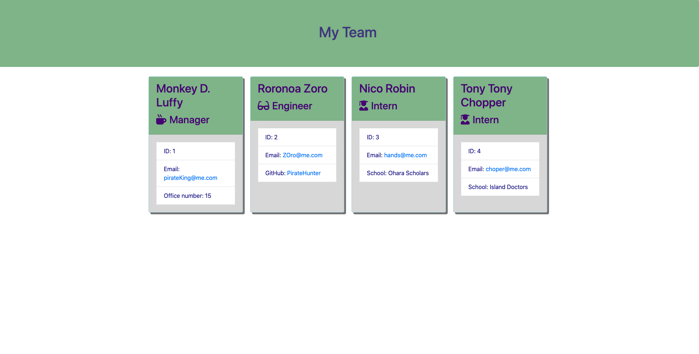

# TeamManagementGenerator

## Description 

A node CLI application that takes in user input to dynamically generate an employee summary html page. 

## Installation 

Once the repository has been forked, npm install to install all of the depedncies in the node package for this app to run. Next 'run test' to make sure all of the test suites are passed. Input 'node app.js' to start the prompt to 'build team'. 

## Usage 

Below is an example of what the HTML output page will look like once all team information is inputed. 

    

## License 

Copyright (c) afbrown1216. 
Licensed under the MIT license.

